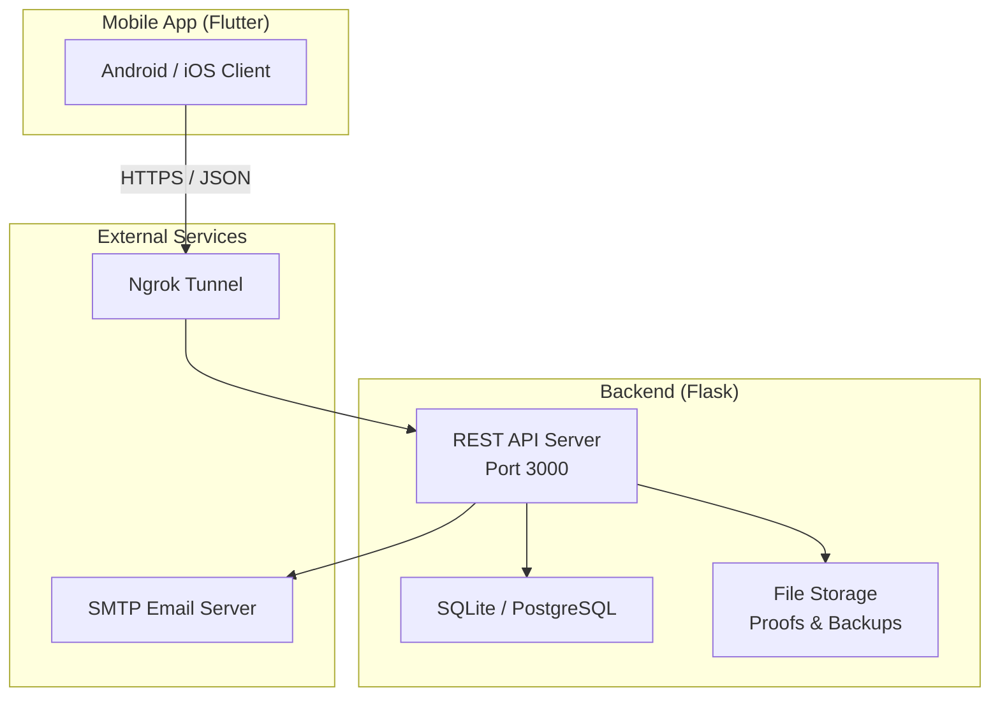
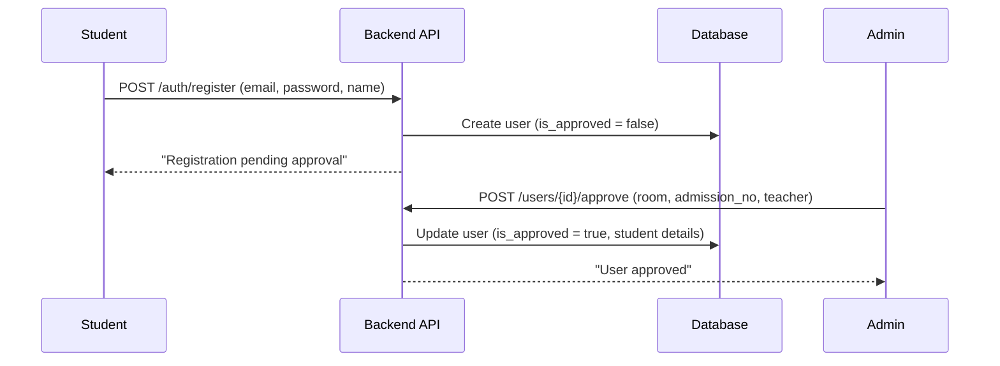
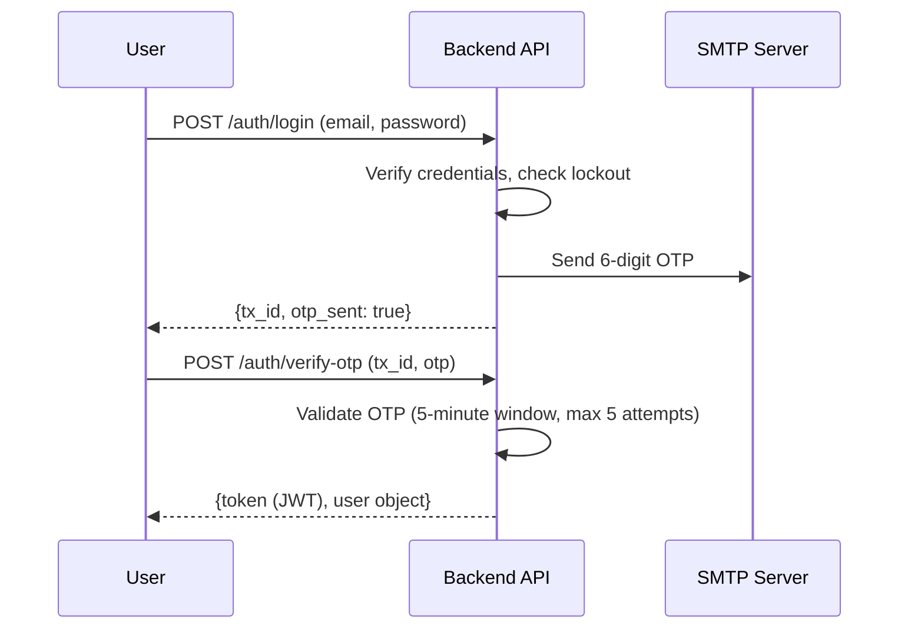
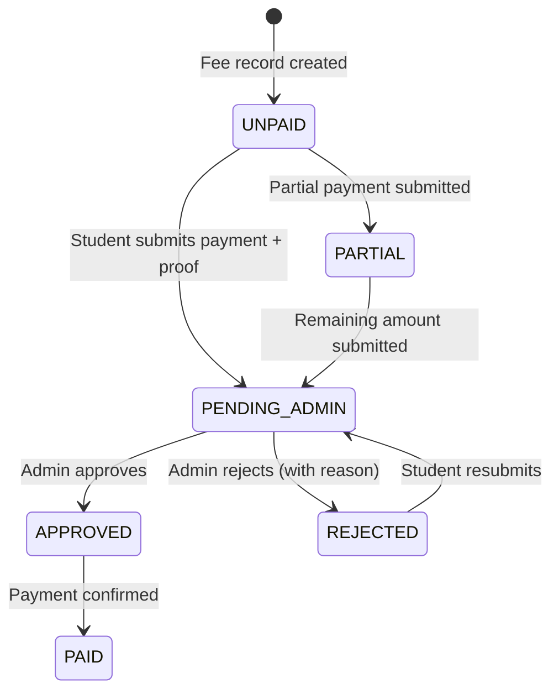
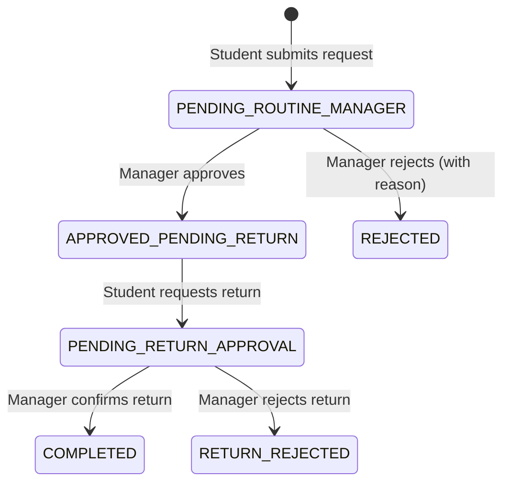
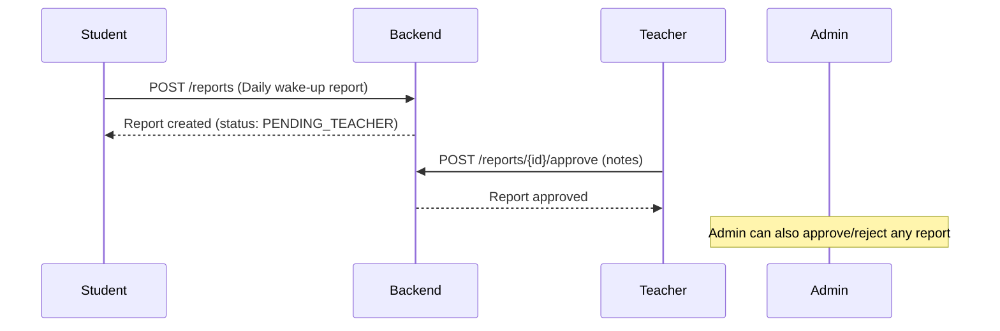

# Hostelix Pro — Product Features Document

**Version:** 1.0  
**Date:** February 10, 2026  
**Classification:** Internal / Stakeholder Reference  
**Platform:** Cross-Platform Mobile (Android & iOS) + RESTful Backend

---

## Table of Contents

1. [Executive Summary](#1-executive-summary)
2. [System Architecture](#2-system-architecture)
3. [User Roles & Permissions](#3-user-roles--permissions)
4. [Authentication & Security](#4-authentication--security)
5. [Dashboard Module](#5-dashboard-module)
6. [User Management](#6-user-management)
7. [Student Profiles](#7-student-profiles)
8. [Fee Management](#8-fee-management)
9. [Routine Management](#9-routine-management)
10. [Daily Reports](#10-daily-reports)
11. [Announcements & Holidays](#11-announcements--holidays)
12. [Notifications](#12-notifications)
13. [Audit Logs](#13-audit-logs)
14. [Backup & Restore](#14-backup--restore)
15. [Account Self-Service](#15-account-self-service)
16. [Settings & Configuration](#16-settings--configuration)
17. [Data Export](#17-data-export)
18. [Remote Access & Deployment](#18-remote-access--deployment)
19. [Technical Specifications](#19-technical-specifications)

---

## 1. Executive Summary

**Hostelix Pro** is a comprehensive hostel management platform designed for educational institutions. It provides end-to-end digital management of student residences, including fee tracking, daily routine monitoring, activity reporting, and secure multi-role access control.

The system serves **four distinct user roles** — Administrators, Teachers, Routine Managers, and Students — each with tailored dashboards, permissions, and workflows. Built with a modern Flutter frontend and a Python Flask backend, Hostelix Pro delivers a seamless, real-time experience across Android and iOS devices.

### Key Highlights

| Capability | Description |
|:---|:---|
| **Multi-Factor Authentication** | Email OTP + optional TOTP 2FA via authenticator apps |
| **Role-Based Access Control** | Four roles with granular permissions per endpoint |
| **Real-Time Dashboards** | Role-specific statistics and activity feeds |
| **Fee Lifecycle Management** | Structure definition → Student submission → Admin approval → PDF challan |
| **Routine Tracking** | Walk/Exit requests with approval workflows and return monitoring |
| **Encrypted Backups** | Full database backup with AES encryption and key-based restore |
| **Remote Access** | Ngrok tunnel integration for access from any network |

---

## 2. System Architecture

| Layer | Technology | Purpose |
|:---|:---|:---|
| **Frontend** | Flutter 3.x / Dart | Cross-platform mobile application |
| **Backend** | Python 3.x / Flask 3.0 | RESTful API server |
| **Database** | SQLite (dev) / PostgreSQL (prod) | Persistent data storage |
| **ORM** | SQLAlchemy + Flask-Migrate (Alembic) | Database abstraction and migrations |
| **Auth** | PyJWT + bcrypt + PyOTP | JWT tokens, password hashing, TOTP |
| **Email** | SMTP (configurable) | OTP delivery and password reset |
| **Export** | ReportLab (PDF), OpenPyXL (Excel) | Document generation |
| **Tunnel** | Ngrok | Secure remote access |

---

## 3. User Roles & Permissions

Hostelix Pro implements a strict **Role-Based Access Control (RBAC)** system with four predefined roles:

### 3.1 Administrator (`admin`)

The top-level role with full system access.

- Create, update, delete, lock/unlock user accounts
- Approve pending student registrations
- Manage fee structures and approve/reject fee submissions
- View all reports, routines, and audit logs
- Create and manage announcements
- Create encrypted backups and perform restores
- Export data to Excel and PDF
- Access the full administrative dashboard with system-wide statistics

### 3.2 Teacher (`teacher`)

Responsible for overseeing assigned students.

- View profiles of assigned students only
- Approve or reject daily reports submitted by assigned students
- Create announcements targeted at their students
- Access the teacher dashboard with daily student status overview
- View routine history for assigned students

### 3.3 Routine Manager (`routine_manager`)

Manages student movement in and out of the hostel.

- Approve or reject walk and exit requests
- Confirm student returns
- Track students currently out of the hostel
- Monitor late returns with time-based alerts
- Access the routine manager dashboard with pending requests and live status
- View student profiles (limited fields)

### 3.4 Student (`student`)

The end-user of the hostel system.

- Self-register with email (pending admin approval)
- Submit daily wake-up reports
- Create walk and exit requests
- Request return confirmation
- Submit monthly fee payments with proof uploads
- View personal fee calendar, routines, and report history
- View announcements from admin, assigned teacher, and routine managers
- Manage personal profile (bio, skills, status message)

---

## 4. Authentication & Security

### 4.1 Registration Flow

- Students self-register with email, password, and display name
- Accounts are created with `is_approved = false`
- Admin must explicitly approve each registration
- During approval, admin assigns room number, admission number, and teacher

### 4.2 Multi-Factor Authentication (MFA) Login

- **Step 1:** Email + password verification → OTP sent to registered email
- **Step 2:** OTP verification → JWT token issued
- OTP has a 5-minute expiry window
- Maximum 5 OTP verification attempts per transaction
- JWT tokens carry user ID, role, and expiration claims

### 4.3 Account Lockout Protection

| Parameter | Value |
|:---|:---|
| Max failed login attempts | 5 |
| Lockout duration | 30 minutes |
| Auto-unlock | Yes (time-based) |
| Admin manual lock/unlock | Yes |

### 4.4 Two-Factor Authentication (TOTP)

- Users can enable TOTP-based 2FA via authenticator apps (Google Authenticator, Authy, etc.)
- QR code generated server-side using `pyotp` and `qrcode`
- Setup requires initial code verification before activation
- Disabling 2FA requires current password confirmation
- All 2FA actions are logged in the audit trail

### 4.5 Password Reset Flow

- User submits email via `/auth/forgot-password`
- Backend sends a 6-digit OTP to the email
- User submits OTP + new password via `/auth/reset-password`
- OTP validated, password updated, lockout counters reset
- Branded HTML email template with security notices

### 4.6 JWT Token Management

- Tokens stored securely in `SharedPreferences`
- Automatic expiry checking before each API request
- Token cleared on logout or expiration
- Bearer token authentication on all protected endpoints

---

## 5. Dashboard Module

Each user role has a tailored dashboard providing real-time insights:

### 5.1 Admin Dashboard

| Widget | Data Displayed |
|:---|:---|
| Total Users | Count of all registered users |
| Total Students | Count of active students |
| Fee Collection | Monthly collection summary and statistics |
| Pending Reports | Reports awaiting teacher/admin action |
| Active Routines | Currently active walk/exit requests |
| Recent Announcements | Latest system-wide announcements |
| System Health | Backend connectivity status |

- Animated grid background with HUD-style cyberpunk theme
- Dark mode optimized with neon accent colors

### 5.2 Teacher Dashboard

| Widget | Data Displayed |
|:---|:---|
| Assigned Students | List of students under supervision |
| Daily Status | Per-student wake-up report status for today |
| Pending Reports | Reports pending teacher approval |
| Student Activities | Routines and attendance for assigned students |
| Quick Actions | Approve/reject reports inline |

### 5.3 Routine Manager Dashboard

| Widget | Data Displayed |
|:---|:---|
| Pending Requests | Walk/exit requests awaiting approval |
| Currently Out | Live count and list of students outside |
| Pending Returns | Students who have checked out but not returned |
| Late Returns | Students past their expected return time |
| Today's Activity | Summary of approved/rejected/completed routines |

### 5.4 Student Dashboard

| Widget | Data Displayed |
|:---|:---|
| Daily Report Status | Today's wake-up report (submitted / pending) |
| Active Routine | Current walk/exit status |
| Fee Summary | Outstanding and upcoming fee amounts |
| Recent Announcements | Latest announcements from admin and teacher |
| Quick Actions | Submit report, request walk/exit |

---

## 6. User Management

> **Access:** Admin only

### 6.1 User CRUD Operations

| Operation | Endpoint | Description |
|:---|:---|:---|
| **List Users** | `GET /users` | List all users with role and lock status filters |
| **Get User** | `GET /users/{id}` | Retrieve full user profile by ID |
| **Create User** | `POST /users` | Create new user with email, password, role, display name |
| **Update User** | `PATCH /users/{id}` | Update email, name, role, lock status |
| **Delete User** | `DELETE /users/{id}` | Permanently remove user and associated data |
| **Lock/Unlock** | `POST /users/{id}/lock` | Toggle account lock status |
| **Approve** | `POST /users/{id}/approve` | Approve pending registration with student details |

### 6.2 Student Approval Workflow

When approving a student, the admin assigns:
- **Admission Number** — Unique identifier within the institution
- **Room Number** — Hostel room assignment
- **Assigned Teacher** — Teacher responsible for the student's daily reports

### 6.3 User Interface

- Searchable and filterable user list
- Inline lock/unlock toggle
- Role badge indicators
- Approval status indicators for pending students

---

## 7. Student Profiles

### 7.1 Role-Based Access

| Role | Access Level |
|:---|:---|
| Admin | All student profiles, full details |
| Teacher | Assigned students only |
| Routine Manager | All students, limited fields |

### 7.2 Student Profile Data

| Field | Type | Description |
|:---|:---|:---|
| `admission_no` | String | Unique admission number |
| `room` | String | Assigned hostel room |
| `assigned_teacher_id` | Integer | Supervising teacher's user ID |
| `profile_json` | JSON | Extended profile data (profile picture, etc.) |
| `bio` | Text | Student bio / interests |
| `skills` | Text | Skills and competencies |
| `status_message` | String | Current status |

### 7.3 Student Activity Calendar

- Endpoint: `GET /users/{id}/activities`
- Returns detailed activity history grouped by date
- Includes reports, routines, fee submissions
- Calendar view in the admin interface

---

## 8. Fee Management

### 8.1 Fee Structure Definition

> **Access:** Admin only

| Field | Description |
|:---|:---|
| Name | Structure label (e.g., "Standard Monthly Fee") |
| Amount | Base fee amount |
| Description | Optional details |

- Admins define reusable fee structures
- Structures can be created, updated, and listed
- Each student's monthly fee references a structure

### 8.2 Fee Lifecycle

### 8.3 Fee Calendar (Matrix View)

- Endpoint: `GET /fees/calendar?year=2026`
- Returns a **student × month** matrix showing fee status
- Each cell contains: status, expected amount, paid amount, pending amount
- Admin sees all students; student sees only their own row
- Yearly totals calculated automatically

### 8.4 Fee Statistics

- Current month collection summary
- Total expected vs. total collected
- Outstanding balance calculations
- Per-status breakdown (paid, pending, rejected, unpaid)

### 8.5 Payment Proof Upload

- Students upload payment proof images via multipart upload
- Files stored on the server with secure filenames
- Proofs attached to transactions for admin review

### 8.6 Transaction History

- Each fee record maintains a list of transactions
- Transactions track: amount, proof path, status (PENDING/APPROVED/REJECTED)
- Admin can approve or reject individual transactions

### 8.7 Fee Challan (PDF Download)

- Endpoint: `GET /fees/{id}/challan`
- Generates a professionally formatted PDF challan using ReportLab
- Includes student details, fee breakdown, payment status, and institution branding

---

## 9. Routine Management

### 9.1 Request Types

| Type | Description | Who Creates |
|:---|:---|:---|
| **Walk** | Short-duration outing within campus vicinity | Student |
| **Exit** | Extended departure requiring formal approval | Student |
| **Return** | Check-in confirmation after walk/exit | Student (request) → Manager (confirm) |

### 9.2 Routine Lifecycle

### 9.3 Request Payload

Exit requests carry additional context:
- Reason for leaving
- Expected return time
- Companion details
- Destination information

### 9.4 Live Monitoring

| Feature | Description |
|:---|:---|
| **Currently Out** | Real-time list of students outside the hostel |
| **Late Returns** | Students who exceeded their expected return time |
| **Pending Approvals** | Requests awaiting manager action |
| **Return Confirmations** | Students waiting for return sign-off |

### 9.5 Calendar View

- Admin can view routines grouped by date (month/year)
- Daily summary: total routines, walks, exits, returns
- Historical analysis and trend identification

---

## 10. Daily Reports

### 10.1 Report Flow

### 10.2 Report Status Flow

| Status | Description |
|:---|:---|
| `PENDING_TEACHER` | Awaiting assigned teacher's review |
| `APPROVED` | Teacher or admin approved the report |
| `REJECTED` | Teacher or admin rejected (reason required) |

### 10.3 Role-Based Report Access

| Role | Visible Reports |
|:---|:---|
| Student | Own reports only |
| Teacher | Reports from assigned students (filterable by status) |
| Admin | All reports (filterable by status) |

### 10.4 Report Export

- Admin can export all reports to Excel format
- Generated using OpenPyXL with formatted columns
- Downloaded as `.xlsx` file

---

## 11. Announcements & Holidays

### 11.1 Announcement Types

| Type | Description |
|:---|:---|
| `general` | Standard informational announcement |
| `holiday` | Holiday declaration with date range |
| `event` | Event notification with specific date |
| `urgent` | High-priority alert |

### 11.2 Priority Levels

| Priority | Display Behavior |
|:---|:---|
| `low` | Standard display |
| `normal` | Default priority |
| `high` | Highlighted display |
| `urgent` | Top of feed with alert styling |

### 11.3 Targeting & Visibility

| Creator Role | Visibility Scope |
|:---|:---|
| Admin | All users (or targeted by role) |
| Routine Manager | All users (or targeted by role) |
| Teacher | Only their assigned students |

- Announcements can target specific roles (`student`, `teacher`, etc.) or `all`
- Students only see announcements from admins, routine managers, and their assigned teacher
- Role-based and author-based filtering ensures privacy

### 11.4 Holiday Calendar

- Endpoint: `GET /announcements/holidays?year=2026`
- Returns all holiday-type announcements for a given year
- Sorted by event date
- Supports date ranges with `event_date` and `end_date`

### 11.5 Announcement Management

| Operation | Access |
|:---|:---|
| Create | Admin, Teacher, Routine Manager |
| View | All roles (filtered) |
| Delete | Admin only |

---

## 12. Notifications

### 12.1 Notification System

| Feature | Description |
|:---|:---|
| **Per-User Inbox** | Each user has a personal notification feed |
| **Read/Unread State** | Notifications track read status |
| **Badge Count** | Unread count available via dedicated endpoint |
| **Mark as Read** | Individual or bulk mark-all-as-read |

### 12.2 Endpoints

| Endpoint | Method | Description |
|:---|:---|:---|
| `/notifications` | GET | Get notifications (filter: `unread=true`, `limit=N`) |
| `/notifications/{id}/read` | POST | Mark single notification as read |
| `/notifications/read-all` | POST | Mark all notifications as read |
| `/notifications/unread-count` | GET | Get unread notification count |

---

## 13. Audit Logs

> **Access:** Admin only

### 13.1 Tracked Actions

| Action Category | Examples |
|:---|:---|
| **Authentication** | `LOGIN_SUCCESS`, `LOGIN_FAILED`, `LOGOUT` |
| **User Management** | `USER_CREATE`, `USER_UPDATE`, `USER_DELETE`, `USER_LOCK` |
| **Profile Changes** | `UPDATE_PROFILE`, `CHANGE_PASSWORD` |
| **Security** | `ENABLE_2FA`, `DISABLE_2FA` |
| **Fee Operations** | `FEE_APPROVE`, `FEE_REJECT` |
| **Announcements** | `ANNOUNCEMENT_CREATE`, `ANNOUNCEMENT_DELETE` |
| **Backups** | `BACKUP_CREATE`, `BACKUP_RESTORE_VERIFY` |

### 13.2 Log Data Points

Each audit log entry captures:
- **User ID** — Who performed the action
- **Action** — What was done
- **Entity** — Which resource type was affected
- **Entity ID** — Specific resource identifier
- **IP Address** — Request origin
- **Device / User-Agent** — Client information
- **Details** — Additional context (JSON)
- **Timestamp** — When the action occurred

### 13.3 Filtering & Pagination

- Filter by action type
- Filter by entity type
- Paginated results (configurable per-page count)
- Ordered by most recent first

---

## 14. Backup & Restore

> **Access:** Admin only

### 14.1 Backup Creation

- Full database backup exported as an encrypted file
- **AES encryption** applied with a randomly generated key
- Encryption key returned to the admin (must be saved securely)
- Backup metadata stored in the database (filename, size, timestamp)

### 14.2 Backup Management

| Operation | Description |
|:---|:---|
| **Create** | Generate new encrypted backup |
| **List** | View all backups with metadata |
| **Download** | Download encrypted backup file |
| **Restore** | Verify and restore from backup using encryption key |

### 14.3 Security Model

- Backup files are encrypted at rest
- Restoration requires the exact encryption key used during creation
- All backup operations are logged in the audit trail
- Files stored in a dedicated server-side directory

---

## 15. Account Self-Service

Every authenticated user can manage their own account:

### 15.1 Profile Management

| Field | Editable |
|:---|:---|
| Display Name | ✅ |
| Email | ✅ (unique validation) |
| Bio | ✅ |
| Skills | ✅ |
| Status Message | ✅ |

### 15.2 Password Change

- Requires current password verification
- Minimum 6-character password requirement
- Action logged in audit trail

### 15.3 Two-Factor Authentication Self-Service

| Action | Endpoint | Requirements |
|:---|:---|:---|
| Setup 2FA | `POST /account/2fa/setup` | Returns QR code + secret key |
| Verify 2FA | `POST /account/2fa/verify` | Authenticator code required |
| Disable 2FA | `POST /account/2fa/disable` | Current password required |

---

## 16. Settings & Configuration

### 16.1 Application Settings

| Setting | Description |
|:---|:---|
| **Theme Mode** | Dark / Light mode toggle (Dark mode default) |
| **Backend URL** | Configurable API host for remote access |
| **Notifications** | Notification preferences |
| **Language** | Interface language selection |

### 16.2 Backend Configuration

- Users can view and modify the API host URL
- Smart URL cleaning: strips trailing slashes and `/api/v1` suffixes
- Reset to default option available
- Requires app restart after changes

### 16.3 Theme System

| Feature | Description |
|:---|:---|
| Default theme | Dark Mode |
| Persistence | Theme preference saved to local storage |
| Toggle | Accessible from Settings page |
| Cyberpunk style | Animated grid background, HUD-like dashboard elements |

---

## 17. Data Export

### 17.1 Excel Export

| Data Type | Format | Access |
|:---|:---|:---|
| Reports | `.xlsx` | Admin |

- Generated server-side using OpenPyXL
- Formatted columns with headers
- Downloaded as attachment

### 17.2 PDF Export

| Data Type | Format | Access |
|:---|:---|:---|
| Fee Challans | `.pdf` | Admin / Student |

- Generated server-side using ReportLab
- Professionally formatted with institution branding
- Includes student details, fee breakdown, and payment status

---

## 18. Remote Access & Deployment

### 18.1 Ngrok Integration

- Automated setup via `run_remote.bat` script
- Auto-detects ngrok binary (PATH or local directory)
- Configures auth token automatically
- Launches backend server and ngrok tunnel in separate windows
- CORS configured for all origins (`CORS_ORIGINS=*`)

### 18.2 Ngrok Compatibility

- `ngrok-skip-browser-warning` header added to all API requests
- Prevents ngrok's interstitial warning page from blocking API calls
- Transparent to end users

### 18.3 Deployment Options

| Platform | Type | Complexity |
|:---|:---|:---|
| **Ngrok** | Quick tunnel (development/testing) | Low |
| **Local Network** | Direct IP on shared WiFi | Low |
| **Render** | Cloud PaaS (production) | Medium |
| **Railway** | Cloud PaaS (production) | Medium |
| **Fly.io** | Edge deployment (production) | Medium |

---

## 19. Technical Specifications

### 19.1 Backend Dependencies

| Package | Version | Purpose |
|:---|:---|:---|
| Flask | 3.0.0 | Web framework |
| Flask-SQLAlchemy | 3.1.1 | ORM integration |
| Flask-Migrate | 4.0.5 | Database migrations |
| Flask-CORS | 4.0.0 | Cross-origin request handling |
| bcrypt | 4.1.2 | Password hashing |
| PyJWT | 2.8.0 | JWT token management |
| pyotp | 2.9.0 | TOTP generation and verification |
| python-dotenv | 1.0.0 | Environment variable management |
| redis | 5.0.1 | Caching and session management |
| gunicorn | 21.2.0 | Production WSGI server |
| email-validator | 2.1.0 | Email format validation |
| cryptography | 42.0.0 | Backup encryption (AES) |
| openpyxl | 3.1.2 | Excel file generation |
| reportlab | ≥ 4.0.0 | PDF file generation |
| qrcode | ≥ 7.0.0 | QR code generation for 2FA |
| pillow | ≥ 10.0.0 | Image processing |

### 19.2 Frontend Dependencies

| Package | Purpose |
|:---|:---|
| Flutter SDK | Cross-platform UI framework |
| `http` | HTTP client for API communication |
| `shared_preferences` | Local key-value storage |
| `provider` | State management |
| `flutter_launcher_icons` | App icon generation |

### 19.3 API Endpoint Summary

| Module | Base Path | Endpoints |
|:---|:---|:---|
| Auth | `/api/v1/auth` | 7 endpoints |
| Users | `/api/v1/users` | 9 endpoints |
| Account | `/api/v1/account` | 6 endpoints |
| Dashboard | `/api/v1/dashboard` | 3 endpoints |
| Reports | `/api/v1/reports` | 5 endpoints |
| Routines | `/api/v1/routines` | 8 endpoints |
| Fees | `/api/v1/fees` | 10 endpoints |
| Announcements | `/api/v1/announcements` | 4 endpoints |
| Notifications | `/api/v1/notifications` | 4 endpoints |
| Audit | `/api/v1/audit` | 1 endpoint |
| Backups | `/api/v1/backups` | 4 endpoints |
| **Total** | | **61 endpoints** |

### 19.4 Data Models

| Model | Table | Purpose |
|:---|:---|:---|
| User | `users` | Authentication and RBAC |
| Student | `students` | Extended student profile |
| Fee | `fees` | Monthly fee records |
| FeeStructure | `fee_structures` | Fee templates |
| Transaction | `transactions` | Payment transactions |
| Report | `reports` | Daily wake-up reports |
| Routine | `routines` | Walk/exit/return requests |
| Announcement | `announcements` | System announcements |
| Notification | `notifications` | User notification inbox |
| AuditLog | `audit_logs` | Security audit trail |
| BackupMeta | `backup_meta` | Backup file metadata |

### 19.5 Frontend Page Map

| Directory | Pages | Description |
|:---|:---|:---|
| `pages/auth/` | 6 pages | Login, Signup, OTP, Forgot Password, Reset Password, Splash |
| `pages/admin/` | 6 pages | Dashboard, Users, Fees, Audit, Backup, Student Activities |
| `pages/common/` | 4 pages | Announcements, Reports, Student Profiles, Settings |
| `pages/student/` | 3 pages | Dashboard, Fee Page, Routine Page |
| `pages/teacher/` | 2 pages | Dashboard, My Students |
| `pages/manager/` | 1 page | Routine Manager Dashboard |
| **Total** | **22 pages** | |

---

*This document was generated as part of the Hostelix Pro v1.0 release. For setup instructions, refer to the [Developer Setup Guide](DEV_SETUP.md) and the [Deployment Guide](../docs/deployment_guide.md).*
